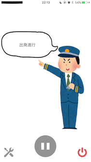

# MabeeeAllAboard

[MaBeee](http://mabeee.mobi/) voice controller for iOS

## Usage

1. Set MaBeee to Pra-rail or other train toys.
2. Run MaBeeeAllAboard app.
3. Tap `Settings` button and try to connect MaBeee.
4. Tap `Rec` button and say "出発進行(Shuppatsu-shinko)"
5. Pra-rail moves!

## Requirements

- iOS 10.0+
- Xcode 8
- Swift 3
- [MaBeee SDK](https://github.com/novars-jp/MaBeeeiOSSDK)

## License

[MIT](LICENSE)
